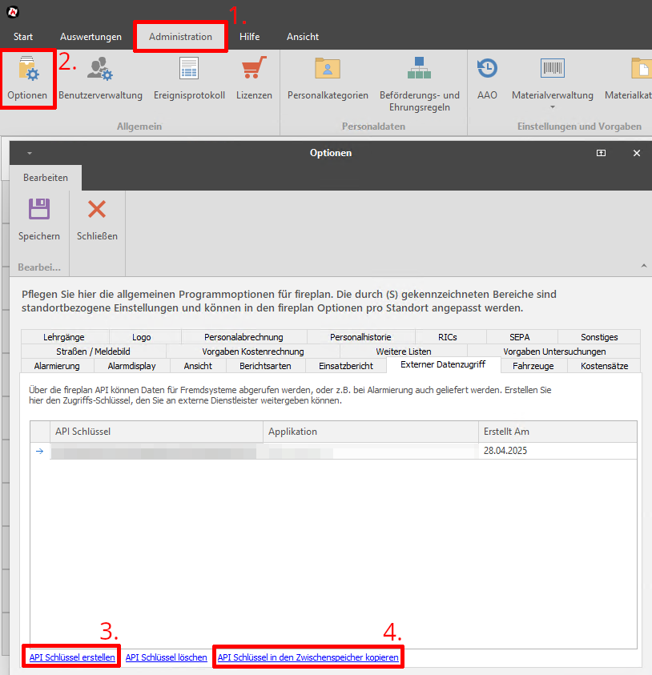

# python-fireplan

[](https://pypi.org/project/python-fireplan)
[](https://github.com/Bouni/python-fireplan/actions/workflows/test-and-lint.yaml)

Ein Python Modul um die Öffentliche [fireplan](https://data.fireplan.de/swagger/index.html) API.

## Installation

```sh
pip install python-fireplan
```

## Verwendung

1. API-Key in Fireplan erzeugen


2. Einen Standort Registrieren

```python
from fireplan import Fireplan

fp = Fireplan("Mein-API-Key")
fp.register("Mein-Standort")
```

> [!NOTE]  
> Das API-Token ist zeitlich begrenzt. Läuft es ab, wird es automatisch über den Register Endpoint erneuert.

### Alarm senden

```python
fp.send_alarm({
  "ric": "1234567",
  "subRIC": "A",
  "einsatznrlst": "20250429001",
  "strasse": "Musterstrasse",
  "hausnummer": "23",
  "ort": "Musterhausen",
  "ortsteil": "Musterteil",
  "objektname": "Schule",
  "koordinaten": "48.6928957,9.1928973",
  "einsatzstichwort": "Probealarm",
  "zusatzinfo": "Was ist denn da los?"
})
```

### Mehrere Alarme senden

```python
fp.send_alarms([
  {"ric": "1234567", "subRIC": "A", "einsatznrlst": "20250429001", "einsatzstichwort": "Probealarm"},
  {"ric": "7654321", "subRIC": "B", "einsatznrlst": "20250429001", "einsatzstichwort": "Probealarm"},
])
```

> [!NOTE]  
> `ric`, `subRIC`, `einsatznrlst` und `einsatzstichwort` sind Pflichtfelder, `zusatzinfo` darf maximal 512 Zeichen lang sein.

### Einsatzliste abrufen

```python
operations = fp.get_operations_list(2024)
```

### Einsatztagebuch abrufen

```python
logs = fp.get_operations_log("123456","Mein-Standort")
```

### Einsatztagebuch Eintrag anlegen

```python
fp.add_operations_log({
  "id": 2025015,
  "einsatzNrLeitstelle": "20250429001",
  "tagebuchText": "Mein Text",
  "von": "Max Meier",
  "an": "Herbert Müller",
  "standort": "Grossbrand Fa. Heinrich",
  "typ": "Info",
  "timestamp": "2025-04-29T14:04:25.459Z"
})
```

### FMS Status senden

```python
fp.set_fms_status({
  "fzKennung": "1234567",
  "status": "2",
  "statusTime": "2025-04-29T14:08:22.030Z"
})
```

> [!NOTE]  
> fzKennung korrespondiert mit der Spalte FZRIC unter Administration -> Optionen -> Fahrzeuge

### Kalender abrufen

```python
calendar = fp.get_calendar()
```

### Personalakten abrufen

```python
personnel = fp.get_personnel_records("Mein-Standort")
```

### Inbound SMS

```python
fp.send_inbound_sms({
  "tstamp": "2025-04-29T14:08:22",
  "sender": "+491701234567",
  "text": "Einsatz XY",
  "modem": "1"
})
```

### Sonstige Dienste abrufen

```python
other_services = fp.get_other_services(2024)
```

### Termine abrufen

```python
events = fp.get_events(1)
```

> [!NOTE]  
> Die Kalendernummer die übergeben werden muss kann über den API Endpoint get_calendar() herausgefunden werden.

### Termin anlegen

```python
fp.add_event({
  "startDate": "2025-04-28T14:08:22.030Z",
  "endDate": "2025-04-29T14:08:22.030Z",
  "allDay": True,
  "subject": "Papiersammlung",
  "location": "Gerätehaus",
  "description": "Halbjährliche Papiersammlung",
  "jahr": "2025",
  "monat": "04",
  "kalenderID": 15
})
```

> [!NOTE]  
> Die KalenderID die übergeben werden muss kann über den API Endpoint get_calendar() herausgefunden werden.

## Testing

```sh
uv run pytest
```

## Notice of Non-Affiliation and Disclaimer

We are not affiliated, associated, authorized, endorsed by, or in any way officially connected with Fireplan, or any of its subsidiaries or its affiliates. The official Fireplan website can be found at https://www.fireplan.de.

The name Fireplan as well as related names, marks, emblems and images are registered trademarks of their respective owners.

